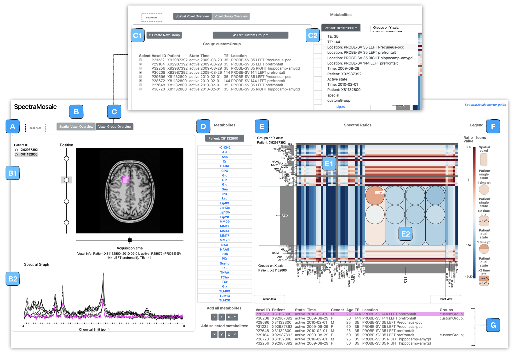

# SpectraMosaic Analysis Tool
SpectraMosaic is an exploratory tool developed for the interactive visual analysis of magnetic resonance spectroscopy (MRS) data.

## Upstream processing steps for analysis
To use this application, you need to have performed a number of preprocessing steps with the initial spectral acquisition. This tool is downstream of the spectral voxel registration and model fitting steps. This has been developed to pair with output from GE MR scanners, but can be extended to work with others, such as Siemens. 

We are working on a more automated solution to read in the data structures in a more convenient way, but for now:
In order to create the image and file structure necessary to be read into the tool, run spectramosaic_prep.py from the /scripts/spectramosaic_prep directory. This will create the following image, spectra, and structural settings that SpectraMosaic is looking for. This script has a number of python version and package dependencies and some software requirements, listed below:
- python2 as the virtual environment for this tool (see below for how to set up a python venv if you are unsure) with these packages:
    - pfile.py (included in /scripts/spectramosaic_prep directory)
    - mergemasks.py (included in /scripts/spectramosaic_prep directory)
    - nibabel
    - numpy
    - scipy
    - Pillow
    - opencv
- You also need to have these 2 softwares installed on your machine:
    - Matlab
    - Tarquin 

### Set up a python2 virtual environment in my project directory
`$ cd <spectramosaic directory>`\
`$ virtualenv venv --python=python2.7`  name the version of python that I want to run my project in \
`$ source venv/bin/activate`    you know it’s activated if you have (env) in bash \
`$ which python`    way to verify you are in your python virtual environment (should be the path to your directory in your project\

### Install python package dependencies into project directory:
`$ pip install nibabel` 	install in your venv; this also brings in numpy\
`$ pip install Pillow`\
`$ pip install scipy`\
`$ pip install opencv-python` (sometimes this won’t go until after you try running $ the prep script first, not sure why)\

## Run spectramosaic_prep.py (example code here, if you are on a Mac)
From your python virtual enviroment in the SpectraMosaic project directory, run the file. There are more detailed notes and instructions at the head of this script as well. 

`$ python <path to script>/spectramosaic_prep.py -o <output folder path> <structural data path> 
/P*7`

Following these steps, you should have produced the files and directory structure needed by SpectraMosaic. Note that this script is compatable with GE scanner software v25 and below. It is currently not compatable with v.26, which we hope to have supported soon. 

## File and Directory Structure Requirements
### Structural image 
Structural reference images need to, as of this version (1.9.2019) require 3 `.png` files for each plane (axial, coronal, sagittal) with the voxel drawn and baked into the image. 

### Spectral graph 
Spectral acquisition and model fit data should be in `.csv` format, organized into 4 columns:
- column 1: ppm, x-axis coordinates
- column 2: raw data output, y-axis coordinates
- column 3: model fit, y-axis coordinates
- column 4: baseline, y-axis coordinates

### Directory structure
You will need a project hierarchy setup with the following structure:
- root
    - patient_xxx
        - voxel_xxx
        - voxel_xxx
    - patient_xxx
        - voxel_xxx
        - voxel_xxx
    - ___header_info.csv

NB: You will get a validation error if your structure is not set like this. As an example structure we have a test data folder loaded that has already done through the preparatory script - see `neuroinflammation_set_spatial_study.zip` as reference dataset. Extract this folder, then drag the directory into the drop window of the application to load in the dataset. 

## How to use

Study datasets are loaded into the application using a drag and drop window feature -- these data remain linked semantically in the application to ensure continuity between voxel location, its spectral output, and patient-specific information.

We see our patient selector panel on the left - radial buttons allow display of one patient with associated acquisition data at a time. Here we have selected patient F900, and can see in the image view the three voxels acquired for this patient, arrayed along this vertical axis. Mousing over each voxel node shows voxel ID and echo time used in the acquisition protocol. Selection of a voxel shows voxel position on the anatomical image. A horizontal axis indicates the number of different time acquisitions performed for this voxel — in this case we are interested in looking at only one time acquisition. 

To analyze spectral ratios we simply click and drag voxels of interest from this left selector panel over to the right. In this case we interested in comparing all spatial voxels of one patient to all spatial voxels of the other patient. 

Once both axes have spectra attached a heatmap matrix is drawn onscreen. This drawing updates each time spectra are added to or removed from the panel. Since there are typically 20 metabolites in a spectrum we have drawn this matrix as a 20 x 20 grid.

As we mouse over the table cells we can easily see the segments of metabolite spectra from each axis that are used in ratio calculations with corresponding area calculations displayed, as well as the metabolites that we can expect to see in this region. Cell size can be adjusted on the fly for targeted analysis of specific metabolites. We use two diverging colormaps; red/blue indicates a metabolite ratio with calculated positive model baseline deviation, while brown/teal indicates a metabolite ratio with calculated negative model baseline deviation. In both colormaps white indicates a ratio of 1,meaning metabolite concentrations being compared are equal. Warm tones indicate a ratio greater than 1, while cool tones indicate a ratio smaller than 1. Luminance decreases with numerical distance from 1. 

Each cell can be expanded to show detailed metabolite ratio information for a given cell. A legend to the right of the spectral tile panel shows colormap values as well as glyphs used for voxel (rounded rectangle), patient (disc), patient with dual states (split filled disc), and patient with time series data (split or solid rounded square; split if patient data includes states). 

For instance, perhaps we would like to inspect individual ratio variation for NAA versus lipds (ML) for this study. On expansion we can see that as we mouse over elements, associated patient spectra are highlighted in fuschia along the graph axes, and the corresponding table row, or rows, which contain useful information about the patient voxel sample. To further preserve the linkage to the source image, voxel ID selectors are filled in fuschia in the left panel. In instances where the spectral voxel is located in a patient not currently displayed, the relevant patient ID selector is filled in with fushcia. 

We can see through the similar hues of the colormap that both patients are quite similar across all three voxels, although ratio tooltips show slight variations. We see the greatest difference in the prefrontal voxel sample resulting from a higher ratio for patient F425. Such subtle changes are difficult to understand through visualization of the spectral graph or through statistical measures alone. 

If we wish to reset the heatmap canvas they can simply click the reset view button at the bottom right of the interface to re-standardize the spectral grid. To clear the heatmap canvas, we click the clear data button.
